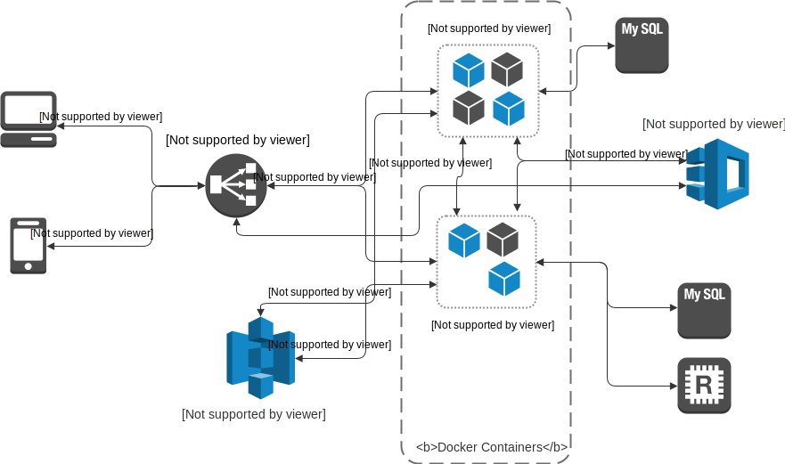

# Dev comments
Name of the project "Aldebaran" wasn't my own Idea as I used some "online name generator"( I don't remember which one).

Project is split into four top level modules:

* __aldebaran-common__ : provides common functionality for the other two modules.
* __aldebaran_integration_tests__ : as the name suggest it contains integration tests of few rest services
* __aldebaran-auth-micro__ : microservice resposible for authentication and user management
* __aldebaran-order-micro__ :  microservice responsible for order management

Normally, I would have split each of the top level modules into a separate repositories, so instead of including the common project as a gradle project, it would be included as normal dependency.

### Architecture

Each microservice uses Consul for service discovery and Ribbon for client side load balancing.



### aldebaran-auth-micro
Requires several environment variables for configuration:
* __Database variables__:
    * DATABASE_HOST: database host
    * DATABASE_PORT: database port
* __Consul variables__:
    * CONSUL_ENABLED: flag indicating if consul service discovery is enabled
    * CONSUL_HOST: consul host (some values is always required)
    * CONSUL_PORT: consul port (some values is always required)
    * DISCOVERY_SERVICE_NAME: name under which the server will be register, required only if consul is enabled    
    * DISCOVERY_SERVICE_PORT: port under which the service will be registered
    * DISCOVERY_HEALTH_CHECK_INTERVAL: interval used for health checking, required only if consul is enabled
* __Service variables__ :
    * SERVICE_PORT: port on which the application will be running
* __Redis variables__ :
    * REDIS_ENABLED: flag indicating if redis is enabled
    * REDIS_HOST: redis host (some values is always required)
    * REDIS_PORT: redis port (some values is always required)

### aldebaran-order-micro
Requires several environment variables for configuration:
* __Database variables__:
    * DATABASE_HOST: database host
    * DATABASE_PORT: database port
* __Consul variables__:
    * CONSUL_ENABLED: flag indicating if consul service discovery is enabled
    * CONSUL_HOST: required only if consul is enabled
    * CONSUL_PORT: required only if consul is enabled
    * DISCOVERY_SERVICE_NAME: name under which the service will be register, required only if consul is enabled    
    * DISCOVERY_SERVICE_PORT: port under which the service will be registered
    * DISCOVERY_HEALTH_CHECK_INTERVAL: interval used for health checking, required only if consul is enabled
    * ALDEBARAN_AUTH_HOST: host of the aldebaran-auth-micro service
    * ALDEBARAN_AUTH_PORT: port of the aldebaran-auth-micro service
* __Service variables__ :
    * SERVICE_PORT: port on which the application will be running
    
# Installation instructions

The easiest way to run the project is through [vagrant](https://www.vagrantup.com/) and packer [packer](https://www.packer.io/).

#### Installation with vagrant

Run the following commands (*assuming we are in a root directory of the project*):

```bash
cd vms/packer
packer build ubuntu.json
cd ../prod
chmod +x run.sh  
./run.sh
vagrant up
```

#### Import to intellij

Each top level module, should be imported as a separate project.

# Endpoint list

List of base endpoints common to all microservices.

#### Swagger endpoints

* /api-docs/swagger.json

#### Monitoring endpoints

*  /monitor/health
*  /monitor/metrics